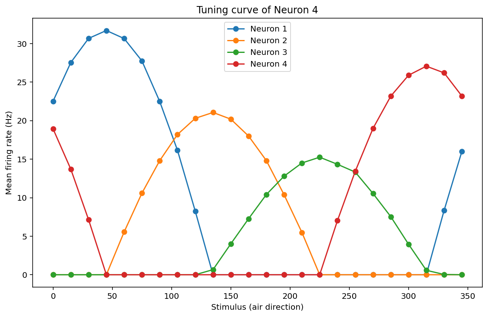

# Population Tuning and Poisson Model Validation

## Description

This project analyzes the response properties of a small neural population to a directional sensory stimulus (air flow direction). The goal is to characterize how individual neurons encode stimulus information through their firing rates and to evaluate whether their spike count variability follows a Poisson statistical model.

The study focuses on two main aspects of neural coding:

- **Sensory tuning**: How selectively each neuron responds to different stimulus directions.  
- **Spike statistics**: Whether the variability of neural firing can be explained by a Poisson process, a common assumption in computational neuroscience models.

This type of analysis is commonly used to study population coding, neural reliability, and probabilistic models of sensory representation.

---

## Methods

### Dataset

The dataset is stored in a serialized Python (`.pickle`) file and contains:

- A vector of stimulus values representing air direction angles.  
- Neural response matrices for four neurons.

Each matrix is structured as:
- **Rows**: repeated trials  
- **Columns**: stimulus conditions

---

### Tuning Curve Analysis

For each neuron, the mean firing rate is computed across trials for every stimulus direction. This produces a tuning curve that describes the neuron's stimulus preference and selectivity.

The tuning curves are plotted together to allow direct comparison between neurons in terms of:

- Preferred stimulus direction  
- Response amplitude  
- Tuning width

---

### Poisson Model Validation

To evaluate whether neural firing follows Poisson-like statistics, the variance-to-mean ratio (Fano Factor) is computed for each stimulus condition:

For a Poisson process, this ratio is expected to be close to 1. The script computes:

- The average Fano Factor across stimuli  
- The standard deviation of the ratio as a measure of consistency  

This analysis provides insight into the reliability and variability of each neuron's response.

---

## Results

### Tuning Curves

The tuning curves show that each neuron is selectively responsive to a different range of stimulus directions, indicating distributed sensory encoding across the population.

- **Neuron 1 and Neuron 4** show strong, well-defined tuning peaks, suggesting high selectivity.  
- **Neuron 2** exhibits moderate tuning with a broader response profile.  
- **Neuron 3** displays a weaker and more distributed response pattern.  

This suggests a population coding strategy where different neurons specialize in different stimulus ranges.

---

### Poisson Statistics

The variance-to-mean ratios indicate different statistical regimes across neurons:

- **Neurons 1, 2, and 4** show very low Fano Factors and low variability, suggesting highly regular and reliable firing.  
- **Neuron 3** shows a much higher ratio and greater variability, indicating more irregular and non-Poisson-like firing behavior.  

---

## Files

- `_e96f8f1cf1f8256c8595dcb9668fee4f_tuning_3.4.pickle`  
  Serialized dataset containing stimulus values and neural response matrices.

- `population_tuning_and_poisson_model_validation.py`  
  Python script for loading the data, plotting tuning curves, and validating Poisson firing statistics.

